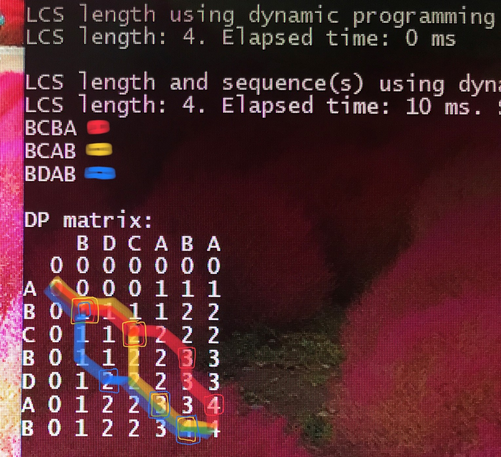
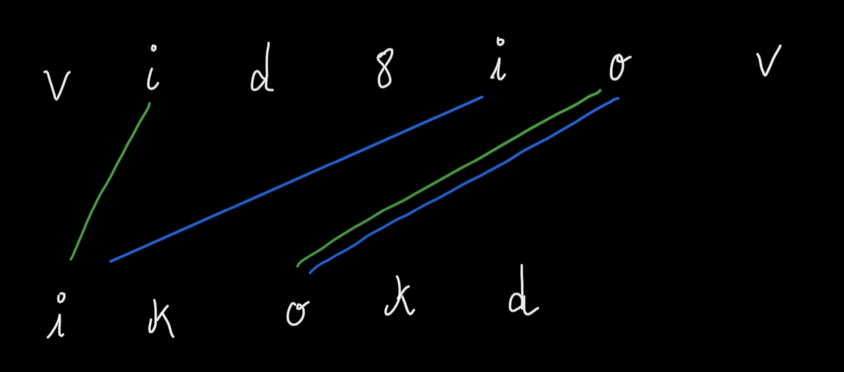
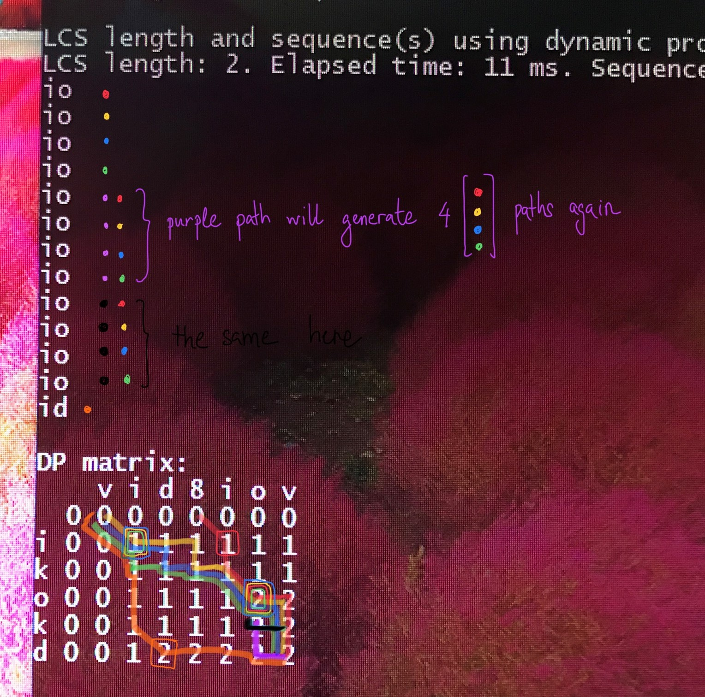
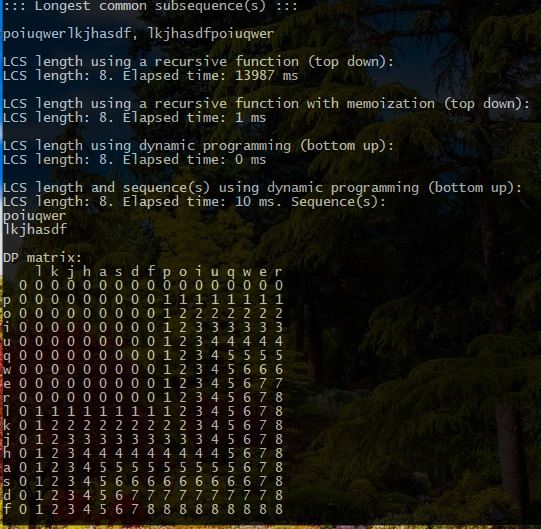

# CA.DP.LongestCommonSubsequence
Solves Longest Common Subsequence problem using Dynamic Programming, length and all subsequences.

It uses three different approaches:
* recursive
* recursive + memoization
* dynamic programing

## Examples

In this first example, you can see how subsequences are generated based on the Dynamic Programming matrix.

In this second example, you can see how subsequences are generated based on the Dynamic Programming matrix.
Note that in this case there are multiple duplicates. However, these duplicates are in fact different combinations
since they are generated from different paths.
This basically means that "io" is different than "io" if those letters are placed in different locations in the
original strings. E.g.:

In this last example we can understand the different algorithm's performance.
* Recursive solution does not scale. O(2^(n+m))
* Recursive + memoization scales. O(n x m)
* Dynamic Programming scales. O(n x m)

